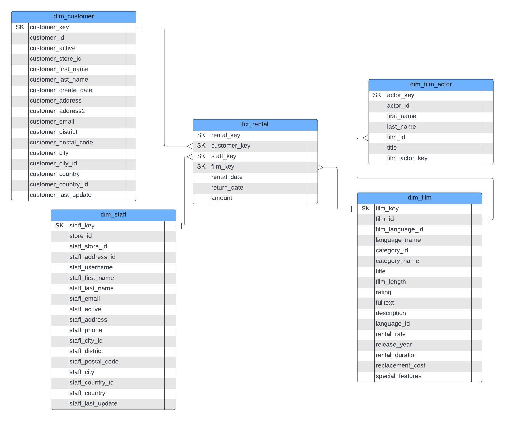
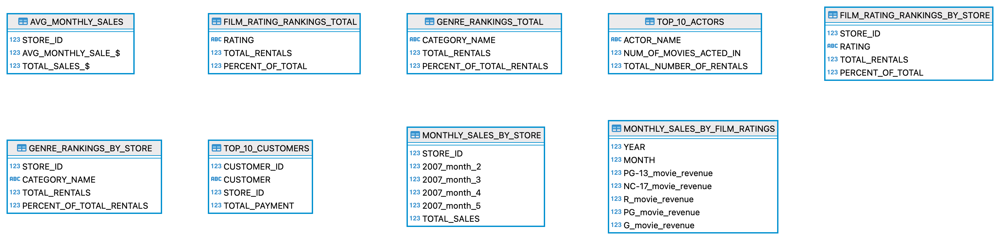
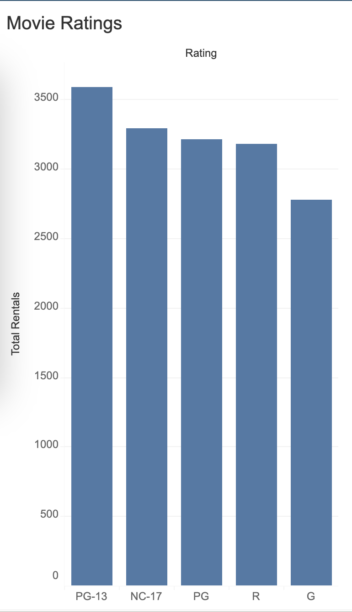
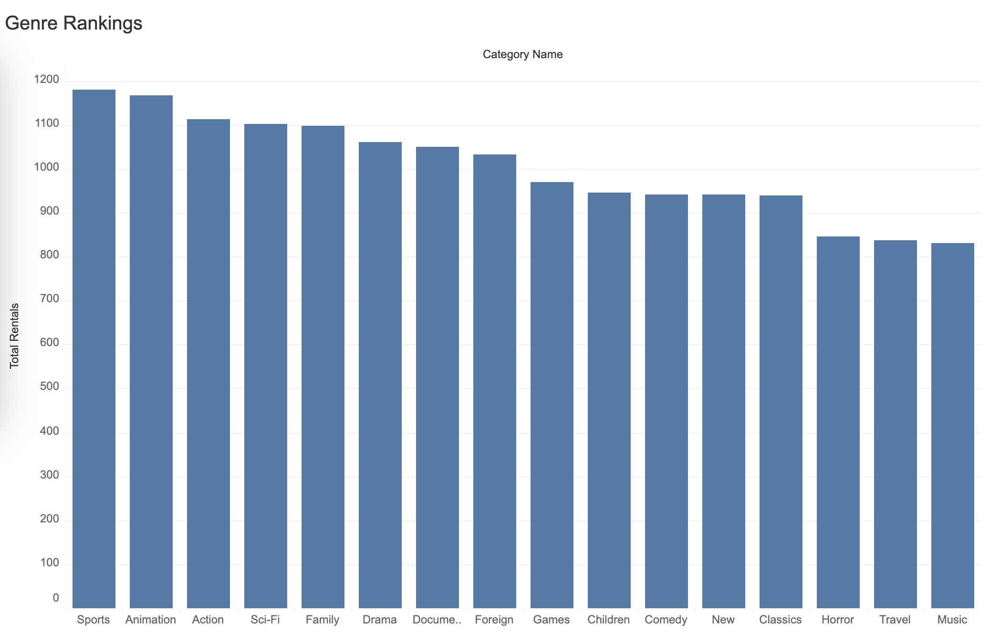
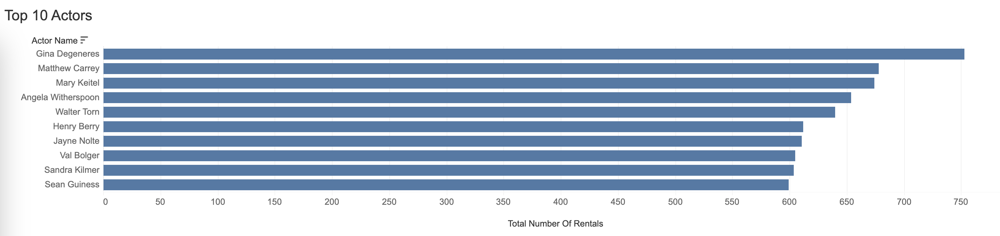
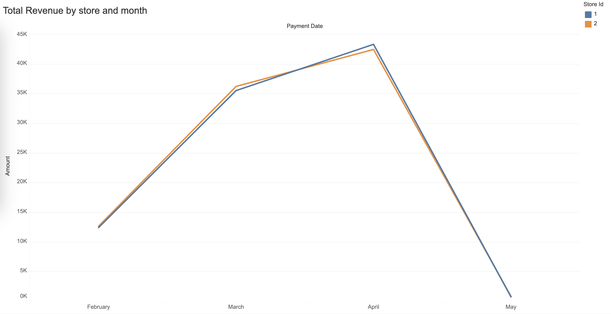

# DVD Rental ELT Pipeline

<p align="center">
  
</p>

## Overview

This document provides an overview of the ELT project that utilizes Airbyte to extract data from an OLTP (Online Transactional Processing) DVD Rental database stored in PostgreSQL and load it into a "mock" OLAP data warehouse hosted within Snowflake for downstream processing.

The goal was to answer the following business questions:

- What film rating was the most rented?
- What genre was the most popular?
- What were the actors with the most rented dvds? (top 10)
- Which store had the most revenue/month?

## Project Components


### 1. Source Database: DVD Rental Database (OLTP)

The source database is an OLTP system running on PostgreSQL. We have chosen the DVD Rental database as our source system for its realistic simulation of a DVD rental store's operations. The database includes tables such as Customers, Films, Rentals, Inventory, and Payments, providing comprehensive data for analysis.

The DVD Rental database comes pre-populated with sample data, allowing for immediate exploration and analysis without the need for extensive data entry. It serves as an ideal dataset for educational and training purposes, offering a realistic scenario for practicing SQL queries, data analysis, and database management techniques.

### 2. Destination Data Warehouse: Snowflake (OLAP)

Snowflake is the destination data warehouse where the extracted data from the DVD Rental database will be loaded for analytical processing.

### 3. Data Extraction Tool: Airbyte

Airbyte is the data extraction tool that was used in this project. It is an open-source project and it is responsible for extracting data from our source database and loading it into the 'Raw Schema' within our Data Warehouse (Snowflake).

### 4. Data Transformation Tool: dbt

For our transformations, we utilized DBT (Data Build Tool) to achieve streamlined and modular data transformation. DBT not only facilitates data transformation but also supports testing to ensure the accuracy of our transformations and final tables. The process involves DBT gathering raw data loaded into Snowflake, transforming it, and subsequently loading it into user-defined schemas. In our specific case, these schemas include Staging, Marts, and Reports. Thus, our data flow follows this sequence: Raw Schema → DBT → Creation of schemas (Staging, Marts, Reports) and all associated tables within these schemas.

### 5. Orchestrator: `orchestrate.sh` bash file

The orchestrator responsible for running the workflow and calling each step in the correct order is a bash file. While there are more robust and specific tools for orchestrating data pipelines, this project focuses on understanding each step more deeply without having to worry about the orchestration part.

### 6. BI Tool: Tableau

Tableau is the BI tool we chose to create visualizations and analysis of our transformed data.

## Project Workflow

1. **Extraction (E)**: Airbyte connects to the PostgreSQL database and leverages the enabled Change Data Capture (CDC) functionality to extract data efficiently. CDC ensures that only the changed or updated data since the last extraction is captured. CDC also allows for the capture of hard deletes from source data.

2. **Loading (L)**: Airbyte loads the extracted data into Snowflake using the appropriate Snowflake connector. The data is loaded into a `raw` schema.

3. **Transformation (T)**: Transformation tasks, if necessary, can be performed with downstream processes such as DBT running against Snowflake. These tasks are responsible for creating the `staging`, `marts`, and `reports` schemas.

## Implementation Steps

1. **Set up Source Database**:
    - Create a PostgreSQL database in AWS RDS.
    - Connect to the database using a management tool for PostgreSQL and restore the DVD Rental database

2. **Deploy Airbyte on AWS EC2 with SSH Tunneling**:
    - Launch an EC2 instance on AWS and connect to it via SSH.
    - Install Docker and Docker Compose on the EC2 instance.
    - Clone the Airbyte repository and start the Docker containers.
    - Access Airbyte securely via SSH tunneling.

3. **Set up Airbyte**:
    - The initial trigger for Airbyte's connection to the PostgreSQL database was facilitated by enabling Change Data Capture (CDC) within the source system.
    - Airbyte utilizes the CDC functionality to track changes in the source database, ensuring that only incremental data is extracted during each extraction cycle.
    - The extracted data is then loaded into Snowflake for further processing and analysis.

4. **Integrate Airbyte into ELT pipeline**:
    - Create a Python code to programmatically control Airbyte through its API. For more reference, go to <https://api.airbyte.com/> to see how the API works.
    - In this project, the `integrate/pipelines/airbyte_extract_load.py` Python file hosts the code responsible for triggering the PostgreSQL - Snowflake connection sync.
    - In order to run the `integrate/pipelines/airbyte_extract_load.py` Python file, please provide the following environment variables:
        - `AIRBYTE_USERNAME`
        - `AIRBYTE_PASSWORD`
        - `AIRBYTE_SERVER_NAME`
        - `AIRBYTE_CONNECTION_ID`
        - `SNOWFLAKE_USERNAME`
        - `SNOWFLAKE_PASSWORD`

5. **Transform the Data:**
    - Install dbt and the dbt plugin for Snowflake using the following commands in the terminal (bash):

    ```bash
    pip install dbt-core==1.7.0

    pip install dbt-snowflake==1.7.0
    ```

    - Run `dbt init` in the Command Line Interface (CLI) to initialize DBT and start a new project.
    - Provide the project's name, creating a dedicated folder within the directory where DBT was initialized.
    - The `models` folder within this directory is where transformations are defined.
    - Each folder in the `models` folder represents a schema within the database, with each file within these folders representing a model for a table in the schema.
    - Define the transformations for each model using DBT's Snowflake SQL syntax.

6. **Orchestrate Workflow**:
    - Create a bash file to run the workflow and call each step in the correct order.
    - In this project, the `orchestrate.sh` file is responsible for orchestrating the tasks: first it calls the Airbyte API, installs the dbt packages and then performs the transformations materializing the dbt models.

7. **Schedule ELT pipeline on the cloud**:
    - Package up the code and all the dependencies with Docker. The `Dockerfile` is responsible for assembling the necessary Docker image to run this project.
    - Push the Docker image to AWS ECR.
    - Create a Scheduled task in ECS to run the Docker container by pulling the Docker image from AWS ECR.

## CDC Functionality Screenshots

Here are some screenshots that demonstrate the CDC functionality working inside Airbyte:

1. **Insert Functionality**:


2. **Update Functionality**:


3. **Delete Functionality**:


## ER Diagrams

### Original DVD Rental ERD


### Marts Schema ERD



### Reports Schema ERD



## Conclusion

As stated earlier, our goal was to answer the following questions:

- What movie rating was the most rented? (Across All Stores)
- What genre was the most popular? (Across All Stores)
- What were top 10 actors with the most rented dvds?
- Which store had the most revenue/month?

We used Tableau to visualize these findings:

- What film rating was the most rented? (Across All Stores)
  - PG-13
  - NC-17
  - PG



- What genre was the most popular? (Across All Stores)
  - Sports
  - Animation
  - Action



- What were top 10 actors with the most rented dvds?
  - Gina Degeneres
  - Matthew Carrey
  - Mary Kietel



- Which store had the most revenue/month?
  - Both were basically even, based on payments made.



Overall, this documentation provides an overview of the ELT project utilizing Airbyte to extract data from a PostgreSQL database, leveraging the Change Data Capture (CDC) functionality for efficient data extraction, and loading it into Snowflake for analytical purposes. By following the outlined steps and best practices, organizations can efficiently manage their data pipeline, enabling informed decision-making and analysis.
